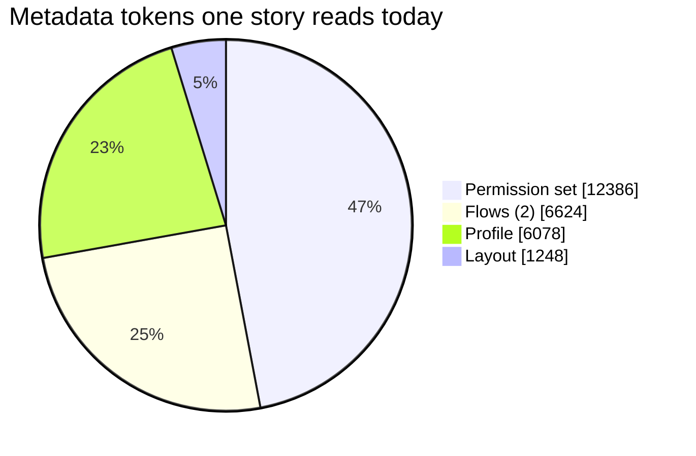
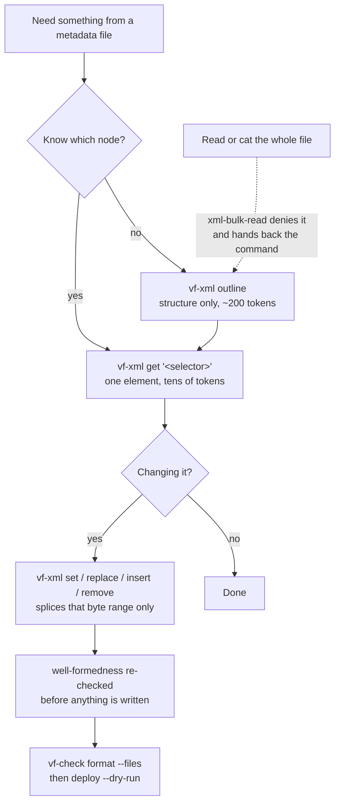

<div align="center">


<h1>Salesforce delivery harness for Claude Code</h1>

<p><b>Salesforce delivery, on rails.</b></p>

<p>VibeForce is a Claude Code plugin for Salesforce development. It turns Claude into a Salesforce
delivery team: parallel Apex, LWC, metadata and integration agents, documentation-grounded skills
for Apex, LWC, Flow and fflib, deterministic hooks, and local plus post-deploy check gates that
refuse to let broken work through.</p>

<p>


</p>

</div>

---

## Why

Asking an assistant for "a trigger and a test" gets you code. It does not get you a feature that
survives a deploy. vibe-force adds the parts that usually go missing:

- **Work happens in parallel.** Apex, LWC, metadata and integration agents build at the same time
  over disjoint paths. A hook denies any write outside an agent's slice, so they cannot collide.
- **Every step is gated.** Not reminders - exit codes. Format, lint, Code Analyzer, Jest, Apex
  coverage, deploy validation. The session cannot end while the local gate is red.
- **Production is protected mechanically.** Direct deploys to a production alias are blocked.
  Destructive operations on production are blocked. Secrets on the command line are blocked.
- **A green deploy is not the finish line.** After the deploy, agents probe the real org: smoke
  Apex, verification queries, limits, fresh error logs.

## Install

```
/plugin marketplace add grzmol/vibe-force
/plugin install vibe-force@vibe-force
```

Send the two lines as separate prompts, then restart the session.

You need Node 20+, Salesforce CLI v2 (`sf`) and git. Full list, local checkout instructions and
project dev dependencies: [docs/installation.md](docs/installation.md).

## Quick start

```
/vf-init                                  # set the project up, discover org aliases
/vf-story "Add renewal reminders to Opportunity"
```

`/vf-story` runs the whole thing:

```
scout -> design -> contract -> parallel build -> parallel checks -> validate + quick deploy -> org verification
wave 0                        wave 1            wave 2             wave 3                     wave 4
```

You stay in control: the contract is shown before any code is written, and the deploy asks before
it touches a shared org.

## Commands

| Command | What it does |
| --- | --- |
| `/vf-init` | Sets a project up: `sfdx-project.json`, `.forceignore`, Jest config, org aliases, npm scripts |
| `/vf-story "<story>"` | The full five-wave workflow, from impact map to verified deploy |
| `/vf-check [check]` | Runs one gate and turns the findings into a minimal fix set |
| `/vf-deploy [org]` | Safe deploy: local gate, validation, your confirmation, quick deploy |
| `/vf-verify [org]` | Post-deploy verification, plus a forward-fix or rollback recommendation |
| `/vf-review [base]` | Parallel quality and security review of a diff, deduplicated |
| `/vf-org [sub]` | Org context: list, use, limits, open, login, health |
| `/vf-xml [sub]` | Reads and patches metadata XML by selector instead of loading whole files |
| `/vf-migrate-workflow` | Classifies workflow rules and converts the mechanical ones to before-save flows |

## What ships inside

| | |
| --- | --- |
| **12 agents** | An orchestrator, a scout, a technical architect, four build engineers on disjoint paths, test, quality, security, deploy and org-verification specialists |
| **31 skills** | Apex, async Apex, governor limits, SOQL/SOSL, LWC, Jest, Flow, security model, deployment, packaging, data, debugging, verification, org security audit, technical debt audit, Agentforce and Data Cloud - plus five on fflib / Apex Enterprise Patterns |
| **12 checks** | One runner, one contract: `format`, `lint`, `analyzer`, `jest`, `static`, `local`, `apex`, `deploy-validate`, `deploy-quick`, `smoke`, `verify`, `all` |
| **8 hooks** | Session context, Bash guard, edit guard, MCP guard, post-edit checks, claim release, stop gate, compaction notes |
| **2 metadata tools** | `vf-xml` reads and patches metadata XML by byte range; `vf-workflow-to-flow` converts workflow rules it can convert and reports the rest |

Every skill is grounded in official Salesforce documentation and ships reference tables, not just
prose. Nothing invents a limit, a flag or a rule id.

## Salesforce-authored plugins

The same marketplace lists eleven plugins published by Salesforce in
[`forcedotcom/sf-skills`](https://github.com/forcedotcom/sf-skills), covering the domains
vibe-force deliberately leaves alone: DevOps Center, integration metadata generation, Shield and
Archive, platform tracing, Lightning Types, React UI bundles, Experience CMS, Mobile SDK, service
messaging channels, B2B Commerce, ISV analytics.

```
/plugin install integration@vibe-force
/plugin install dx-devops@vibe-force
```

They are links, not copies: Claude Code fetches them from Salesforce, and no upstream text lives in
this repository. Upstream declares Apache-2.0 for the repository and CC-BY-NC-4.0 for the npm
package that publishes the same skills, so vibe-force points at it and writes its own skills from
official Salesforce documentation - proven by `scripts/dev/skill-originality.mjs`. The plugins that
would collide with the vibe-force core are deliberately not listed. Full rationale, routing table
and pinning instructions: [docs/salesforce-skills.md](docs/salesforce-skills.md).

## The checks

The same runner is used by agents, hooks, you, and CI:

| Check | Needs an org | What it runs |
| --- | --- | --- |
| `format` | no | `prettier --check` on Apex, LWC, XML, JS |
| `lint` | no | `eslint` on LWC and Aura JavaScript |
| `analyzer` | no | `sf code-analyzer run`, fails at `gates.analyzerFailSeverity` |
| `pairing` | no | every Apex class has a test, every LWC bundle a Jest spec |
| `jest` | no | `sfdx-lwc-jest` plus the `gates.jestCoverageMin` gate |
| `static` | no | format + lint + analyzer + pairing |
| `local` | no | static + jest - the full offline gate |
| `apex` | yes | `sf apex run test` plus the coverage gates |
| `deploy-validate` | yes | check-only deploy; records the quick-deploy job id |
| `deploy-quick` | yes | deploys a previously validated job id |
| `smoke` | yes | post-deploy probes: anonymous Apex, SOQL, limits, logs |
| `verify` | yes | apex + smoke |
| `all` | yes | local + apex + smoke |

`vf-check --help` prints the same list from the runner itself.

```bash
node "${CLAUDE_PLUGIN_ROOT}/scripts/checks/vf-check.mjs" local --changed
node "${CLAUDE_PLUGIN_ROOT}/scripts/checks/vf-check.mjs" apex --target-org acme-dev
node "${CLAUDE_PLUGIN_ROOT}/scripts/checks/vf-check.mjs" verify --target-org acme-uat
```

Exit codes: `0` pass, `1` gate failed, `2` misconfiguration or missing tool, `3` org error.
Every run writes a JSON report to `.vibeforce/reports/`.

Missing a tool is not fatal. A check that cannot find its tool reports `skipped` with an install
hint, so you can adopt the plugin before you adopt every linter.

## Safety rails

| Blocked | Instead |
| --- | --- |
| `sf project deploy start` to a production alias | Validate, then quick deploy the recorded job id |
| Deleting production data or metadata | Explicit override with `VF_ALLOW_PROD=1` |
| Retired `sfdx force:*` syntax | `sf` v2 with an explicit `--target-org` |
| `--no-verify`, force push to a protected branch | Fix the gate |
| Credentials passed on the command line | Auth files and environment variables |
| Writes outside an agent's slice, or to a file another agent holds | Wait for the wave, or ask the owner |
| `deploy_metadata` to production over MCP, `delete_org` on a production alias | The same validate + quick-deploy path; MCP tools do not get a side door ([docs/mcp.md](docs/mcp.md)) |

Four modes - `off`, `minimal`, `standard` (default), `strict`. Per-shell overrides:
`VF_HOOK_MODE`, `VF_ALLOW_PROD=1`, `VF_SKIP_CHECKS=1`, `VF_DEBUG=1`.

## MCP

The plugin ships the official Salesforce DX MCP server (`@salesforce/mcp`), scoped to your default
org and to read-and-analyse toolsets: `core,data,code-analysis,testing`. Deploy tools are off by
default, so deploys stay on the gated CLI path.

```bash
export VF_MCP_TOOLSETS="core,data,metadata,testing"   # opt into deploy and retrieve
export VF_MCP_ORGS="acme-dev,acme-uat"                # pin to explicit aliases
```

MCP tools reach an org without going through Bash, so they get their own guard: a production
`deploy_metadata` or `delete_org` is denied, a deploy with no passing local gate is flagged, and
`retrieve_metadata` is flagged for writing files behind the ownership guard. Rules, tool table and
verification: [docs/mcp.md](docs/mcp.md).

## Metadata XML and the token bill

Salesforce metadata, not Apex, is what drains a session's context: one profile can outweigh every
Apex class it grants access to. Measured on Salesforce's own sample apps, this is where a story that
grants a field, checks a profile, inspects two flows and reads one layout spends its reading budget:



Permission sets and profiles dominate, and neither is ever read for more than a few lines of it.
`vf-xml` indexes a metadata file by byte range, so a session reads structure and single nodes
instead of files.



```bash
git ls-files -z '*.xml' | xargs -0 node "$CLAUDE_PLUGIN_ROOT/scripts/vf-xml.js" stats | tail   # rank the sinks
node "$CLAUDE_PLUGIN_ROOT/scripts/vf-xml.js" outline <profile>                      # ~40 tokens
node "$CLAUDE_PLUGIN_ROOT/scripts/vf-xml.js" get <profile> '//fieldPermissions[field=Account.Rating]'
node "$CLAUDE_PLUGIN_ROOT/scripts/vf-xml.js" set <profile> '<selector>' --value true
```

Patches splice the addressed byte range only, so the file stays byte-identical everywhere else: the
diff stays reviewable, `vf-check format` stays green, and flow canvas coordinates and Metadata API
element order survive. The `xml-bulk-read` guard enforces the habit from both sides - a `Read` and a
shell `cat` of a metadata file over `xml.readMaxBytes` are denied, with the replacement command in
the denial. Bounded reads (`head -50`, `Read` with a `limit`) always pass.

### What it saves

Measured, not estimated, on metadata published by Salesforce in its own sample apps. "Read whole" is
the file; "outline + one node" is the structural summary plus the single element an edit actually
needs. Token counts are bytes over 3.5, the same estimate `vf-xml stats` prints.

| Metadata read | Read whole | outline | + one node | After | Saved | |
| --- | --- | --- | --- | --- | --- | --- |
| Permission set, 208 field permissions (`PMT_Global_Admin`) | 12 386 | 219 | 41 | 260 | **48x** | ████████████ |
| Profile (`GanttChart` `Admin`) | 6 078 | 170 | 44 | 214 | **28x** | ███████ |
| Record-triggered flow, 3 assignments + 4 decisions (`PMT_Task_Before_Automation`) | 3 312 | 243 | 146 | 389 | **9x** | ██ |
| Page layout (`PMT_Program__c`) | 1 248 | 151 | - | 151 | **8x** | ██ |
| Workflow file, 2 rules + 4 field updates, read as a migration plan | 791 | 297 | - | 297 | **3x** | █ |

The ratio grows with file size, because an outline's cost tracks how many *kinds* of child a file
has, not how many nodes: 208 field permissions summarise as one line. The samples above are small -
an enterprise profile or permission set is routinely several times larger, and the saving scales with
it while the outline barely moves.

The same story, summed:

```
read whole   ████████████████████████████████████████████████  26 336 tok
via vf-xml   ██                                                  1 403 tok
```

Roughly **19x**, or 25 000 tokens of context returned to the actual work, per story. Whether that
shows up as cost or as sessions that stop needing compaction depends on where the pressure is.

Workflow rules get the same treatment. `/vf-migrate-workflow plan` classifies every rule in a
workflow file without quoting any XML; `convert` emits the before-save flow for the rules that
convert mechanically - one Assignment on `$Record`, never an Update Records element - and reports the
after-save work rather than guessing at it. Method and mapping tables:
[`skills/sf-project-structure/references/xml-token-economy.md`](skills/sf-project-structure/references/xml-token-economy.md)
and
[`skills/sf-flow-automation/references/workflow-to-flow-migration.md`](skills/sf-flow-automation/references/workflow-to-flow-migration.md).

## Configure

Defaults work out of the box. To tune, edit `.vibeforce/config.json` in your Salesforce project:

```json
{
  "apiVersion": "67.0",
  "orgs": { "dev": "acme-dev", "uat": "acme-uat", "prod": "acme-prod" },
  "productionAliases": ["acme-prod"],
  "gates": {
    "apexOrgCoverageMin": 85,
    "apexClassCoverageMin": 75,
    "jestCoverageMin": 80,
    "analyzerFailSeverity": 3
  },
  "hooks": { "mode": "standard", "stopGate": "static", "autoFormat": true }
}
```

Every key, with defaults and effects: [docs/configuration.md](docs/configuration.md).

## Docs

| | |
| --- | --- |
| [Installation](docs/installation.md) | Prerequisites, marketplace and local install, project setup |
| [Configuration](docs/configuration.md) | Config reference, gates, hook modes, environment overrides |
| [Architecture](docs/architecture.md) | Waves, path ownership, hook and check internals |
| [Salesforce-authored skills](docs/salesforce-skills.md) | The Salesforce plugins this marketplace links, what they cover, why nothing is copied |
| [MCP](docs/mcp.md) | The bundled Salesforce DX MCP server, its scope, and the guard over its tools |

## Contributing

```bash
node --test tests/                  # hook engine suite
node scripts/checks/vf-check.mjs --help
claude plugin validate .            # manifest, agents, skills, commands
node scripts/dev/skill-originality.mjs --corpus /tmp/sf-skills   # no copied external prose
```

The plugin has no npm dependencies and uses Node builtins only. Hooks fail open: a broken handler
never wedges a session. A new guard rule needs a test that fails without it.

## License

MIT
