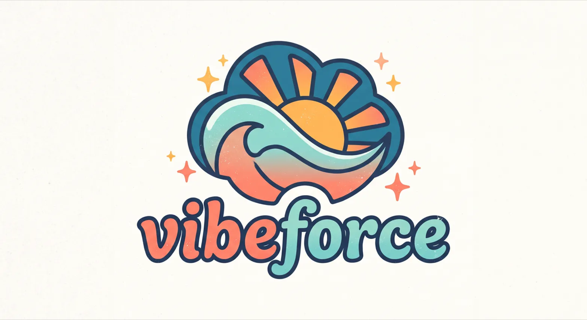

<div align="center">



<h1>VibeForce. Salesforce delivery harness for Claude Code</h1>

<p><b>Salesforce delivery, on rails.</b></p>

<p>VibeForce is a Claude Code plugin for Salesforce development. It turns Claude into a Salesforce
delivery team: parallel Apex, LWC, metadata and integration agents, documentation-grounded skills
for Apex, LWC, Flow and fflib, deterministic hooks, and local plus post-deploy check gates that
refuse to let broken work through.</p>

<p>


</p>

</div>

---

## Why

Asking an assistant for "a trigger and a test" gets you code. It does not get you a feature that
survives a deploy. vibe-force adds the parts that usually go missing:

- **Work happens in parallel.** Apex, LWC, metadata and integration agents build at the same time
  over disjoint paths. A hook denies any write outside an agent's slice, so they cannot collide.
- **Every step is gated.** Not reminders - exit codes. Format, lint, Code Analyzer, Jest, Apex
  coverage, deploy validation. The session cannot end while the local gate is red.
- **Production is protected mechanically.** Direct deploys to a production alias are blocked.
  Destructive operations on production are blocked. Secrets on the command line are blocked.
- **A green deploy is not the finish line.** After the deploy, agents probe the real org: smoke
  Apex, verification queries, limits, fresh error logs.

## Install

```
/plugin marketplace add grzmol/vibe-force
/plugin install vibe-force@vibe-force
```

Send the two lines as separate prompts, then restart the session.

You need Node 20+, Salesforce CLI v2 (`sf`) and git. Full list, local checkout instructions and
project dev dependencies: [docs/installation.md](docs/installation.md).

## Quick start

```
/vf-init                                  # set the project up, discover org aliases
/vf-story "Add renewal reminders to Opportunity"
```

`/vf-story` runs the whole thing:

```
scout -> contract -> parallel build -> parallel checks -> validate + quick deploy -> org verification
wave 0              wave 1            wave 2             wave 3                     wave 4
```

You stay in control: the contract is shown before any code is written, and the deploy asks before
it touches a shared org.

## Commands

| Command | What it does |
| --- | --- |
| `/vf-init` | Sets a project up: `sfdx-project.json`, `.forceignore`, Jest config, org aliases, npm scripts |
| `/vf-story "<story>"` | The full five-wave workflow, from impact map to verified deploy |
| `/vf-check [check]` | Runs one gate and turns the findings into a minimal fix set |
| `/vf-deploy [org]` | Safe deploy: local gate, validation, your confirmation, quick deploy |
| `/vf-verify [org]` | Post-deploy verification, plus a forward-fix or rollback recommendation |
| `/vf-review [base]` | Parallel quality and security review of a diff, deduplicated |
| `/vf-org [sub]` | Org context: list, use, limits, open, login, health |

## What ships inside

| | |
| --- | --- |
| **11 agents** | An orchestrator, a scout, four build engineers on disjoint paths, test, quality, security, deploy and org-verification specialists |
| **27 skills** | Apex, async Apex, governor limits, SOQL/SOSL, LWC, Jest, Flow, security model, deployment, packaging, data, debugging, verification - plus five on fflib / Apex Enterprise Patterns |
| **12 checks** | One runner, one contract: `format`, `lint`, `analyzer`, `jest`, `static`, `local`, `apex`, `deploy-validate`, `deploy-quick`, `smoke`, `verify`, `all` |
| **7 hooks** | Session context, Bash guard, edit guard, post-edit checks, claim release, stop gate, compaction notes |

Every skill is grounded in official Salesforce documentation and ships reference tables, not just
prose. Nothing invents a limit, a flag or a rule id.

## The checks

The same runner is used by agents, hooks, you, and CI:

```bash
node "${CLAUDE_PLUGIN_ROOT}/scripts/checks/vf-check.mjs" local --changed
node "${CLAUDE_PLUGIN_ROOT}/scripts/checks/vf-check.mjs" apex --target-org acme-dev
node "${CLAUDE_PLUGIN_ROOT}/scripts/checks/vf-check.mjs" verify --target-org acme-uat
```

Exit codes: `0` pass, `1` gate failed, `2` misconfiguration or missing tool, `3` org error.
Every run writes a JSON report to `.vibeforce/reports/`.

Missing a tool is not fatal. A check that cannot find its tool reports `skipped` with an install
hint, so you can adopt the plugin before you adopt every linter.

## Safety rails

| Blocked | Instead |
| --- | --- |
| `sf project deploy start` to a production alias | Validate, then quick deploy the recorded job id |
| Deleting production data or metadata | Explicit override with `VF_ALLOW_PROD=1` |
| Retired `sfdx force:*` syntax | `sf` v2 with an explicit `--target-org` |
| `--no-verify`, force push to a protected branch | Fix the gate |
| Credentials passed on the command line | Auth files and environment variables |
| Writes outside an agent's slice, or to a file another agent holds | Wait for the wave, or ask the owner |

Four modes - `off`, `minimal`, `standard` (default), `strict`. Per-shell overrides:
`VF_HOOK_MODE`, `VF_ALLOW_PROD=1`, `VF_SKIP_CHECKS=1`, `VF_DEBUG=1`.

## Configure

Defaults work out of the box. To tune, edit `.vibeforce/config.json` in your Salesforce project:

```json
{
  "apiVersion": "67.0",
  "orgs": { "dev": "acme-dev", "uat": "acme-uat", "prod": "acme-prod" },
  "productionAliases": ["acme-prod"],
  "gates": {
    "apexOrgCoverageMin": 85,
    "apexClassCoverageMin": 75,
    "jestCoverageMin": 80,
    "analyzerFailSeverity": 3
  },
  "hooks": { "mode": "standard", "stopGate": "static", "autoFormat": true }
}
```

Every key, with defaults and effects: [docs/configuration.md](docs/configuration.md).

## Docs

| | |
| --- | --- |
| [Installation](docs/installation.md) | Prerequisites, marketplace and local install, project setup |
| [Configuration](docs/configuration.md) | Config reference, gates, hook modes, environment overrides |
| [Architecture](docs/architecture.md) | Waves, path ownership, hook and check internals |

## Contributing

```bash
node --test tests/                  # hook engine suite
node scripts/checks/vf-check.mjs --help
claude plugin validate .            # manifest, agents, skills, commands
```

The plugin has no npm dependencies and uses Node builtins only. Hooks fail open: a broken handler
never wedges a session. A new guard rule needs a test that fails without it.

## License

MIT
