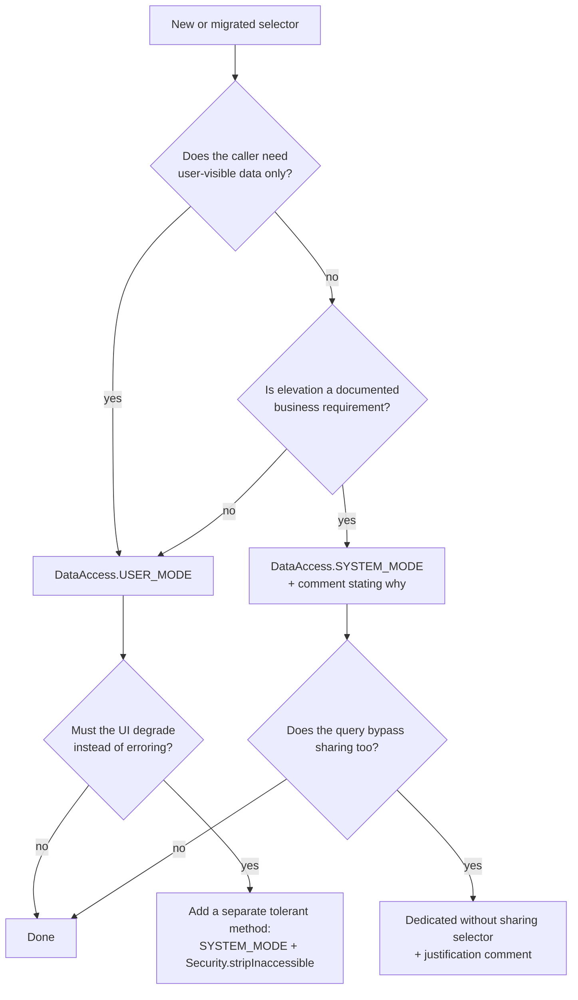

# Selector security: CRUD, FLS and sharing

Library behaviour below was read this session from `fflib-apex-common` @ `master` commit `dab5977`:
`fflib_SObjectSelector.cls`, `fflib_QueryFactory.cls`, `fflib_SecurityUtils.cls`. Platform behaviour
is from the Apex Developer Guide pages linked at the bottom.

## 0. The API version boundary that governs everything here

Target API version for this project is **67.0** (`config/vibe-force.defaults.json`). Apex Developer
Guide, "Apex Security and Sharing Model" -> versioned behavior changes:

| At API version 67.0 and later | Consequence for selectors |
| --- | --- |
| Apex runs in **user context by default**: object permissions and FLS are enforced unless you opt into system mode | a selector that emits no mode clause is no longer implicitly elevated on a 67.0 class |
| `WITH SECURITY_ENFORCED` is **not allowed** in an Apex SOQL `SELECT` | never write it; `fflib_QueryFactory.toSOQL()` never emits it |
| A class with no sharing declaration behaves as `with sharing` | still declare the keyword explicitly, and justify `without sharing` in a comment |
| Opting into system mode is explicit: `WITH SYSTEM_MODE`, `AccessLevel.SYSTEM_MODE`, `as system` | `DataAccess.SYSTEM_MODE` is how a selector does it |

Why the fflib setting still matters at 67.0: `DataAccess.LEGACY` (the default) produces **no** mode
clause, so the query inherits the enclosing class's context. On a 67.0-versioned class that is user
context; on a class still pinned to an older version, or on code reached from an older-versioned
entry point, it is not. Pin the posture in the constructor rather than relying on the version of
whichever class happens to call you.

## 1. Enforcement matrix

| Concern | `DataAccess.USER_MODE` | `DataAccess.SYSTEM_MODE` | `DataAccess.LEGACY` + `enforceFLS`/`enforceCRUD` | `DataAccess.LEGACY` default |
| --- | --- | --- | --- | --- |
| Object read permission (CRUD) | platform, at query time | ignored | `fflib_QueryFactory.assertIsAccessible()` -> `fflib_SecurityUtils.checkObjectIsReadable` | checked (`m_enforceCRUD` defaults `true`) |
| Field read permission (FLS) | platform, at query time | ignored | `fflib_SecurityUtils.checkFieldIsReadable` per field and per path segment | not checked (`m_enforceFLS` defaults `false`) |
| Emitted clause | ` WITH USER_MODE` | ` WITH SYSTEM_MODE` | none | none |
| Failure type | `System.QueryException` from `Database.query` | n/a | `fflib_SecurityUtils.FlsException` / `CrudException` at query-build time | `CrudException` marshalled to `fflib_SObjectDomain.DomainException` |
| Invalid field name detected at build time | **no** (`getFieldPath` short-circuits) | **no** | yes, `InvalidFieldException` | yes |
| SELECT field case | lower-cased by `addField` | lower-cased | canonical | canonical |
| Describe CPU cost | minimal | minimal | high (per-field `DescribeFieldResult`) | moderate |
| Record-level sharing | from the class declaring the code that runs the query | same | same | same |
| Subselect inherits the clause | no - only the top-level query carries a mode | no | n/a | n/a |
| DML side | **not covered** - selectors only read | - | - | - |

What fflib does **not** enforce in a selector, at any setting:

- Write-side CRUD/FLS. That is the Unit of Work's `IDML` implementation
  (`fflib_SObjectUnitOfWork.UserModeDML` vs the deprecated `SimpleDML`) - skill
  `sf-fflib-domain-service-uow`.
- Record-level sharing as a per-query option. There is no `DataAccess.WITHOUT_SHARING`.
- Field *write* accessibility for fields it happens to select.
- Anything about the fields a caller subsequently reads off the returned records.

## 2. How each path works in the source

### 2a. `USER_MODE` / `SYSTEM_MODE`

`fflib_SObjectSelector.configureQueryFactory` maps `DataAccess` onto
`fflib_QueryFactory.FLSEnforcement`:

```apex
fflib_QueryFactory.FLSEnforcement fls = fflib_QueryFactory.FLSEnforcement.NONE;
if (access == DataAccess.USER_MODE)        { fls = fflib_QueryFactory.FLSEnforcement.USER_MODE; }
else if (access == DataAccess.SYSTEM_MODE) { fls = fflib_QueryFactory.FLSEnforcement.SYSTEM_MODE; }
else if (enforceFLS)                       { fls = fflib_QueryFactory.FLSEnforcement.LEGACY; }
queryFactory.setEnforceFLS(fls);
```

`toSOQL()` then appends the clause, but only for a top-level factory:

```apex
//Subselects can't specify USER_MODE or SYSTEM_MODE -- only the top-level query can do so
if (relationship == null && mFlsEnforcement == FLSEnforcement.USER_MODE) {
    result += ' WITH USER_MODE';
}
```

The platform enforces the child rows of a subselect under the same mode as the parent query, so the
missing clause on the child is not a hole - but a subselect factory used standalone would have no
mode at all, which is another reason never to construct one yourself.

### 2b. `LEGACY`

Two distinct checks:

```apex
// object-level, in configureQueryFactory when assertCRUD is true
queryFactory.assertIsAccessible();   // fflib_SecurityUtils.checkObjectIsReadable(table)
// ... CrudException is caught and re-thrown as:
throw new fflib_SObjectDomain.DomainException(
    'Permission to access an ' + getSObjectType().getDescribe().getName() + ' denied.');
```

```apex
// field-level, inside fflib_QueryFactory.getFieldPath / selectSObjectFields
if (mFlsEnforcement == FLSEnforcement.LEGACY) {
    fflib_SecurityUtils.checkFieldIsReadable(this.table, token);
}
```

Note the asymmetry: the CRUD failure is converted into a `DomainException` (a domain-layer type, for
backwards compatibility), while the FLS failure propagates as `fflib_SecurityUtils.FlsException`.
Callers written against the legacy path therefore catch two unrelated types.

`fflib_SecurityUtils` exception messages come from **Custom Labels** shipped in
`sfdx-source/apex-common/main/labels/fflib-Apex-Common-CustomLabels.labels-meta.xml`:
`fflib_security_error_object_not_readable`, `..._object_not_insertable`, `..._object_not_updateable`,
`..._object_not_deletable`, `..._field_not_readable`, `..._field_not_insertable`,
`..._field_not_updateable`. Vendor the classes without the labels and `fflib_SecurityUtils` does not
compile - see skill `sf-fflib-foundations`, `references/install-and-layout.md`.

`fflib_SecurityUtils.BYPASS_INTERNAL_FLS_AND_CRUD` is a public static `Boolean` defaulting to
`false`; setting it true makes every `check*` method a no-op. Treat it as a break-glass switch only,
never as configuration, and never set it in product code.

### 2c. Sharing

```apex
public abstract with sharing class fflib_SObjectSelector   // fflib_SObjectSelector.cls
public class fflib_QueryFactory { //No explicit sharing declaration - inherit from caller
```

The sharing mode applied to a query is the mode of the class **declaring the code that executes it**:

| Query issued from | Sharing mode |
| --- | --- |
| `selectSObjectsById` / `queryLocatorById` (declared in `fflib_SObjectSelector`) | `with sharing` - always |
| your own `selectByRating()` in `AccountsSelector inherited sharing` | the caller's mode |
| your own method in `AccountsSelector with sharing` | `with sharing` |
| your own method in `AccountsSelector without sharing` | sharing ignored - requires a justification comment |

Declare `inherited sharing` on selectors: the base-class methods stay `with sharing`, and your custom
methods follow whichever service or controller invoked them. If a specific query legitimately needs
to bypass sharing, isolate it in a dedicated `without sharing` selector class with a comment stating
why, rather than flipping the whole selector.

## 3. Before and after: migrating a legacy selector

### Before (legacy assertions)

```apex
public with sharing class ContactsSelector extends fflib_SObjectSelector
    implements IContactsSelector
{
    public ContactsSelector() {
        super(false, true, true);      // includeFieldSetFields, enforceCRUD, enforceFLS
    }

    public Schema.SObjectType getSObjectType() { return Contact.SObjectType; }

    public List<Schema.SObjectField> getSObjectFieldList() {
        return new List<Schema.SObjectField> {
            Contact.Id, Contact.LastName, Contact.Email, Contact.SSN__c };
    }

    public List<Contact> selectById(Set<Id> idSet) {
        return (List<Contact>) selectSObjectsById(idSet);
    }
}
```

```apex
// caller
try {
    contacts = ContactsSelector.newInstance().selectById(ids);
} catch (fflib_SecurityUtils.FlsException e) {
    throw new AuraHandledException('You cannot read one of the Contact fields.');
} catch (fflib_SObjectDomain.DomainException e) {
    throw new AuraHandledException('You cannot read Contacts.');
}
```

Generated SOQL: `SELECT Email, Id, LastName, SSN__c FROM Contact WHERE id in :idSet ORDER BY Name ASC
NULLS FIRST` - no mode clause. A user without read on `SSN__c` never reaches the query: the build
throws.

### After (native user mode)

```apex
public inherited sharing class ContactsSelector extends fflib_SObjectSelector
    implements IContactsSelector
{
    public ContactsSelector() {
        super(false, fflib_SObjectSelector.DataAccess.USER_MODE);
    }

    public Schema.SObjectType getSObjectType() { return Contact.SObjectType; }

    public List<Schema.SObjectField> getSObjectFieldList() {
        return new List<Schema.SObjectField> {
            Contact.Id, Contact.LastName, Contact.Email, Contact.SSN__c };
    }

    public List<Contact> selectById(Set<Id> idSet) {
        if (idSet == null || idSet.isEmpty()) { return new List<Contact>(); }
        return (List<Contact>) selectSObjectsById(idSet);
    }
}
```

```apex
// caller
try {
    contacts = ContactsSelector.newInstance().selectById(ids);
} catch (System.QueryException e) {
    throw new AuraHandledException('You do not have access to the requested Contact data.');
}
```

Generated SOQL: `SELECT email, id, lastname, ssn__c FROM Contact WHERE id in :idSet WITH USER_MODE
ORDER BY Name ASC NULLS FIRST`.

### Migration checklist

- [ ] Constructor changed to `super(<includeFieldSetFields>, fflib_SObjectSelector.DataAccess.USER_MODE)`.
- [ ] Every `catch (fflib_SecurityUtils.FlsException)` and legacy `catch (fflib_SObjectDomain.DomainException)` around a *query* replaced with `catch (System.QueryException)`.
- [ ] Any test asserting the legacy exception types updated or deleted - a test that pins `FlsException` after migration is pinning removed behaviour.
- [ ] Field-name typos re-checked: `USER_MODE` no longer raises `InvalidFieldException` at build time. Deploy plus one execution per select method is the new safety net.
- [ ] Tests asserting exact SOQL strings updated for lower-cased field names and unsorted SELECT lists (`sortSelectFields` is `false` in the `(Boolean, DataAccess)` constructor).
- [ ] Sharing keyword made explicit (`inherited sharing` unless there is a reason).
- [ ] Write path migrated separately: `fflib_SObjectUnitOfWork.UserModeDML` in the `Application` UnitOfWork factory.

## 4. When graceful degradation beats an exception

`WITH USER_MODE` fails the whole query when a selected field is inaccessible. When a UI should render
what the user *can* see instead of erroring, query in system mode and strip:

```apex
public List<Contact> selectByIdTolerant(Set<Id> idSet) {
    if (idSet == null || idSet.isEmpty()) { return new List<Contact>(); }

    // Deliberate system-mode read, then strip what the running user cannot see.
    List<Contact> raw = (List<Contact>) Database.query(
        newQueryFactory(false)
            .setEnforceFLS(fflib_QueryFactory.FLSEnforcement.SYSTEM_MODE)
            .selectFields(getSObjectFieldList())
            .setCondition('id in :idSet')
            .toSOQL());

    SObjectAccessDecision decision = Security.stripInaccessible(AccessType.READABLE, raw);
    return (List<Contact>) decision.getRecords();
}
```

`Security.stripInaccessible(AccessType.READABLE, records)` removes fields the user cannot read and
reports what it changed via `getModifiedIndexes()` and `getRemovedFields()`. Trade-offs:

| Approach | User sees | Caller complexity | Audit story |
| --- | --- | --- | --- |
| `WITH USER_MODE` | an error | one `catch` | clean: the query never returns data the user cannot read |
| system mode + `stripInaccessible` | partial data | must handle nulls for stripped fields | acceptable, but the query itself ran elevated - document why |
| legacy `enforceFLS` | an error, thrown earlier | two `catch` types | deprecated |

Only use the tolerant variant for read-only presentation surfaces, never as the default select
method, and never before a DML operation that writes the stripped fields back.

## 5. Tests that prove the behaviour

Enforcement tests need a user whose permissions differ from the running test user. Create a minimal
user plus a permission set in test setup, then `System.runAs`.

```apex
@IsTest
private class ContactsSelectorSecurityTest {
    private static User buildRestrictedUser() {
        Profile p = [SELECT Id FROM Profile WHERE Name = 'Standard User' LIMIT 1];
        User u = new User(
            Alias = 'fflibsec',
            Email = 'fflib.sec@example.com',
            EmailEncodingKey = 'UTF-8',
            LastName = 'Restricted',
            LanguageLocaleKey = 'en_US',
            LocaleSidKey = 'en_US',
            ProfileId = p.Id,
            TimeZoneSidKey = 'America/Los_Angeles',
            UserName = 'fflib.sec.' + System.now().getTime() + '@example.com');
        insert u;
        return u;
    }

    @IsTest
    static void itShouldEmitUserModeForTheModernConstructor() {
        String soql = new ContactsSelector().newQueryFactory().toSOQL();
        System.assert(
            soql.contains('WITH USER_MODE'),
            'Selector must query in user mode. Actual: ' + soql);
    }

    @IsTest
    static void itShouldFailForAUserWithoutFieldAccess() {
        User restricted = buildRestrictedUser();
        Contact c = new Contact(LastName = 'Target', SSN__c = '000-00-0000');
        insert c;                                   // inserted as the elevated test user

        System.Test.startTest();
        Boolean denied = false;
        System.runAs(restricted) {
            try {
                ContactsSelector.newInstance().selectById(new Set<Id>{ c.Id });
            } catch (System.QueryException e) {
                denied = true;                      // user mode rejected the inaccessible field
            }
        }
        System.Test.stopTest();

        System.assert(denied, 'Expected WITH USER_MODE to reject the restricted field read');
    }

    @IsTest
    static void itShouldReturnStrippedRecordsForTheTolerantMethod() {
        User restricted = buildRestrictedUser();
        Contact c = new Contact(LastName = 'Target', SSN__c = '000-00-0000');
        insert c;

        System.Test.startTest();
        List<Contact> results;
        System.runAs(restricted) {
            results = new ContactsSelector().selectByIdTolerant(new Set<Id>{ c.Id });
        }
        System.Test.stopTest();

        System.assertEquals(1, results.size(), 'The record itself is still readable');
        System.assertEquals(null, results[0].SSN__c, 'Inaccessible field must be stripped');
    }
}
```

Two rules for this style of test:

1. The restricted user must genuinely lack the permission. If the target profile happens to grant
   `SSN__c`, the test passes vacuously. Assert the precondition, or grant/withhold through a
   dedicated permission set deployed with the test (skill `sf-security-model`).
2. `System.runAs` does not reset governor limits and does not change the API version the code runs
   under. It changes the user context only.

Do not write a test that asserts the exact generated SOQL string - whitespace and field order are
implementation detail. Assert the presence of `WITH USER_MODE`, or assert observable access
behaviour.

## 6. Static analysis interaction

| Rule | Why a selector trips it | Correct response |
| --- | --- | --- |
| `ApexCRUDViolation` | PMD documents that `WITH USER_MODE` suppresses the violation, but `Database.query(qf.toSOQL())` hides the clause behind a method call, so the rule still fires | scope the rule away from `selectors/`, or configure `readAuthMethodPattern` to recognise your selector base class. Never blanket-suppress in the class header |
| `ApexSOQLInjection` | detects untrusted variables in `Database.query`; the factory's dynamic string looks untrusted | use `Database.queryWithBinds` for caller-supplied values, then scope/justify the remaining findings |
| `ApexSharingViolations` | fires on classes doing DML with no sharing declaration | declare `inherited sharing` (selectors) or `with sharing` (services) explicitly |

PMD's `ApexCRUDViolation` also supports `readAuthMethodPattern` plus
`readAuthMethodTypeParamIndex` properties, which is the supported way to teach it about an
authorization facade. Configuration lives in `config/code-analyzer.yml`; rule tuning is owned by
skill `sf-code-analyzer-quality`.

## 7. Decision guide



## Related

- Skill `sf-security-model` - permission sets, FLS, sharing, `stripInaccessible` in full
- Skill `sf-fflib-domain-service-uow` - write-side enforcement via `UserModeDML`
- Skill `sf-fflib-foundations` - the Custom Labels dependency and install layout
- Skill `sf-code-analyzer-quality` - `ApexCRUDViolation` configuration
- Skill `sf-apex-testing` - `System.runAs` and permission-set test fixtures
- [query-factory-api.md](query-factory-api.md), [selector-recipes.md](selector-recipes.md), [selector-antipatterns.md](selector-antipatterns.md)
- Apex Security and Sharing Model (versioned behavior changes): https://developer.salesforce.com/docs/atlas.en-us.apexcode.meta/apexcode/apex_security_sharing_chapter.htm
- Enforcing user mode for database operations: https://developer.salesforce.com/docs/atlas.en-us.apexcode.meta/apexcode/apex_classes_enforce_usermode.htm
- `with sharing`, `without sharing`, `inherited sharing`: https://developer.salesforce.com/docs/atlas.en-us.apexcode.meta/apexcode/apex_classes_keywords_sharing.htm
- `System.AccessLevel`: https://developer.salesforce.com/docs/atlas.en-us.apexref.meta/apexref/apex_class_System_AccessLevel.htm
- PMD Apex security rules: https://docs.pmd-code.org/latest/pmd_rules_apex_security.html
