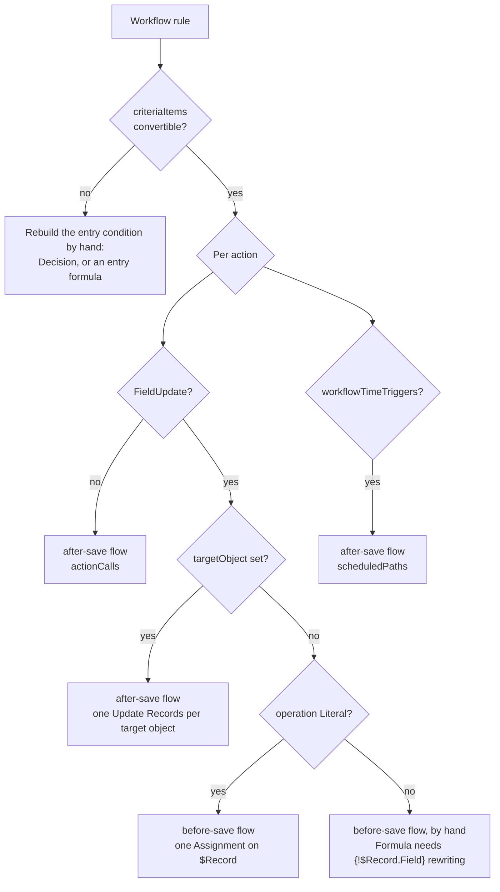

# Workflow rules to record-triggered flows

Workflow rules are retired for new automation and Salesforce ships **Migrate to Flow** in Setup to
move the existing ones. This reference covers the part a session actually has to reason about: which
rules convert mechanically, how each workflow element maps onto Flow metadata, and where a converter
must refuse to guess. The deterministic half is implemented by
`scripts/vf-workflow-to-flow.js`; see the `/vf-migrate-workflow` command.

## The split: two flows, not one

A workflow rule mixes work that belongs on two different sides of the save.



Only the `BS` path is generated. Everything else is reported, because a converter that fills those
branches in from inference produces flows that deploy and then behave differently from the rule they
replaced.

| Work | Flow | Why |
|---|---|---|
| Field updates on the triggering record | **before-save** record-triggered flow, as one Assignment on `$Record` | the record is not in the database yet, so the write costs nothing extra |
| Writes to related records | **after-save** flow, Update Records grouped one element per target object | needs the record Id, so it cannot run before save |
| Email alerts, tasks, outbound messages, invocable actions | **after-save** flow, as `actionCalls` | side effects belong after the record is durable |
| Time-dependent actions | **after-save** flow, as `scheduledPaths` | no before-save equivalent exists |

Two rules follow from this and are not negotiable:

- A before-save flow must never contain an Update Records element for the triggering record. That
  saves the record a second time and discards the only reason to be before-save.
- The after-save flow's Update Records elements are kept to a minimum: one per target object,
  carrying every field assignment for that object. One element per field is one DML per field.

## Trigger mapping

| `WorkflowRule.triggerType` | `FlowStart.recordTriggerType` | `doesRequireRecordChangedToMeetCriteria` |
|---|---|---|
| `onCreateOnly` | `Create` | omitted |
| `onAllChanges` | `CreateAndUpdate` | omitted |
| `onCreateOrTriggeringUpdate` | `CreateAndUpdate` | `true` |

`triggerType` on the flow's `start` is `RecordBeforeSave` for the before-save flow and
`RecordAfterSave` for the after-save one. `processType` is `AutoLaunchedFlow` for both.

## Criteria mapping

`criteriaItems` become `start.filters`; `booleanFilter` becomes `start.filterLogic` verbatim, and
`and` is the default when the rule has none. The workflow field is written `Object.Field` and the
flow filter takes the bare field name, so the object prefix is stripped.

| `FilterItem.operation` | `FlowRecordFilterOperator` |
|---|---|
| `equals` | `EqualTo` |
| `notEqual` | `NotEqualTo` |
| `lessThan` | `LessThan` |
| `greaterThan` | `GreaterThan` |
| `lessOrEqual` | `LessThanOrEqualTo` |
| `greaterOrEqual` | `GreaterThanOrEqualTo` |
| `contains` | `Contains` |
| `startsWith` | `StartsWith` |
| `notContain`, `includes`, `excludes`, `within` | no single equivalent - rebuild as a Decision or an entry formula |

A criterion whose field names another object cannot become a start filter at all: a record-triggered
flow filters the triggering record only. Such a rule needs a Get Records step in an after-save flow.

## Field update mapping

| `WorkflowFieldUpdate.operation` | Converts to | Note |
|---|---|---|
| `Literal` | `assignmentItems` with a typed `value` | the only case that needs no extra information |
| `Formula` | `formulas` element plus `value/elementReference` | the formula's field references must be rewritten to `{!$Record.Field}` |
| `Null` | an assignment to an empty value | needs the field's data type |
| `NextValue`, `PreviousValue` | a Decision over the picklist | needs the picklist's ordered values |
| `LookupValue` | a Get Records step | resolves a User or another object reference |
| any, with `targetObject` set | after-save Update Records | cross-object write |

Workflow metadata stores a literal as a bare string with no declared type, while Flow requires a
typed child (`stringValue`, `numberValue`, `booleanValue`, `dateValue`). The converter infers the
type and prints the inference, because a wrong inference surfaces only at deploy time.

## Flow element order

The Metadata API enforces the XSD sequence, so a generated flow lists its children in this order
(only the elements a converted rule needs are shown):

```
apiVersion, assignments, description, environments, interviewLabel, label,
migratedFromWorkflowRuleName, processType, start, status
```

and inside `start`:

```
locationX, locationY, connector, doesRequireRecordChangedToMeetCriteria,
filterLogic, filters, object, recordTriggerType, triggerType
```

`migratedFromWorkflowRuleName` carries the rule's `fullName`, which is how a reviewer, and the
platform, tie the flow back to what it replaced.

## Shape of a converted rule

```xml
<?xml version="1.0" encoding="UTF-8"?>
<Flow xmlns="http://soap.sforce.com/2006/04/metadata">
    <apiVersion>67.0</apiVersion>
    <assignments>
        <name>Set_Fields</name>
        <label>Set Fields</label>
        <locationX>176</locationX>
        <locationY>287</locationY>
        <assignmentItems>
            <assignToReference>$Record.Priority</assignToReference>
            <operator>Assign</operator>
            <value>
                <stringValue>High</stringValue>
            </value>
        </assignmentItems>
        <assignmentItems>
            <assignToReference>$Record.IsEscalated</assignToReference>
            <operator>Assign</operator>
            <value>
                <booleanValue>true</booleanValue>
            </value>
        </assignmentItems>
    </assignments>
    <description>Escalate cases that arrive urgent.</description>
    <environments>Default</environments>
    <interviewLabel>Case Escalate urgent cases (before save) {!$Flow.CurrentDateTime}</interviewLabel>
    <label>Case Escalate urgent cases (before save)</label>
    <migratedFromWorkflowRuleName>Escalate urgent cases</migratedFromWorkflowRuleName>
    <processType>AutoLaunchedFlow</processType>
    <start>
        <locationX>50</locationX>
        <locationY>0</locationY>
        <connector>
            <targetReference>Set_Fields</targetReference>
        </connector>
        <doesRequireRecordChangedToMeetCriteria>true</doesRequireRecordChangedToMeetCriteria>
        <filterLogic>and</filterLogic>
        <filters>
            <field>Status</field>
            <operator>EqualTo</operator>
            <value>
                <stringValue>New</stringValue>
            </value>
        </filters>
        <object>Case</object>
        <recordTriggerType>CreateAndUpdate</recordTriggerType>
        <triggerType>RecordBeforeSave</triggerType>
    </start>
    <status>Draft</status>
</Flow>
```

One Assignment element carries both fields. Two Assignment elements would be two nodes on the canvas
for no behavioural difference.

## Procedure

```bash
# 1. classify, in a few lines per rule, with no XML in the answer
node "$CLAUDE_PLUGIN_ROOT/scripts/vf-workflow-to-flow.js" plan \
  force-app/main/default/workflows/Case.workflow-meta.xml

# 2. emit the before-save flow for each rule marked "before-save: auto"
node "$CLAUDE_PLUGIN_ROOT/scripts/vf-workflow-to-flow.js" convert \
  force-app/main/default/workflows/Case.workflow-meta.xml --rule 'Escalate urgent cases'

# 3. validate before activating anything
sf project deploy validate --source-dir force-app/main/default/flows --target-org <alias>
```

Then, in this order: build the after-save flow by hand from the plan's `after-save` lines, add the
`before-save by hand` items, activate the flows, verify the behaviour against the org, and only then
deactivate the workflow rule. Deactivating first leaves a window with no automation; deploying both
changes together leaves no way to roll back one of them.

## Anti-patterns

| Anti-pattern | Why it hurts | Fix |
|---|---|---|
| One flow per workflow rule, after-save, with Update Records on the triggering record | a second save of the same record on every trigger | before-save assignment on `$Record` |
| One Update Records element per field | one DML per field | group per target object |
| Generating a flow for a `Formula` field update by copying the formula | workflow formulas use bare field names; a flow needs `{!$Record.Field}` | rewrite the references by hand |
| Generating the flow `Active` | an unverified flow starts firing on the next deploy | `Draft`, then activate after verification |
| Deactivating the workflow rule in the same deploy | no rollback for either half | two deploys |
| Reading the workflow file into the session to plan the migration | tens of thousands of tokens | `plan`, which quotes no XML |
| Keeping both automations active "to be safe" | the field is written twice, order undefined | verify, then deactivate the rule |

## Verification

```bash
node "$CLAUDE_PLUGIN_ROOT/scripts/vf-workflow-to-flow.js" plan <file>          # exit 0
node "$CLAUDE_PLUGIN_ROOT/scripts/vf-workflow-to-flow.js" convert <file> --rule <name>
node "$CLAUDE_PLUGIN_ROOT/scripts/checks/vf-check.mjs" format --files <flow file>
sf project deploy validate --source-dir <flow file> --target-org <alias>
sf data create record --sobject Case --values "Status=New" --target-org <alias>   # then read the field back
```

Exit code `1` from `convert` means the rule does not convert without human work. The plan says which
part; that is the answer, not an obstacle.

## References

- [`flow-metadata-reference.md`](flow-metadata-reference.md) - `Flow` and `FlowStart` fields, trigger enumerations
- [`order-of-execution-for-flows.md`](order-of-execution-for-flows.md) - where before-save and after-save sit in the save order
- [`../../sf-project-structure/references/xml-token-economy.md`](../../sf-project-structure/references/xml-token-economy.md) - reading and patching metadata without loading it
- Metadata API Developer Guide, `Flow`: <https://developer.salesforce.com/docs/atlas.en-us.api_meta.meta/api_meta/meta_visual_workflow.htm>
- Metadata API Developer Guide, `Workflow`: <https://developer.salesforce.com/docs/atlas.en-us.api_meta.meta/api_meta/meta_workflow.htm>
- Migrate to Flow Tool Considerations: <https://help.salesforce.com/s/articleView?id=platform.migrate_to_flow_tool_considerations.htm&type=5>
