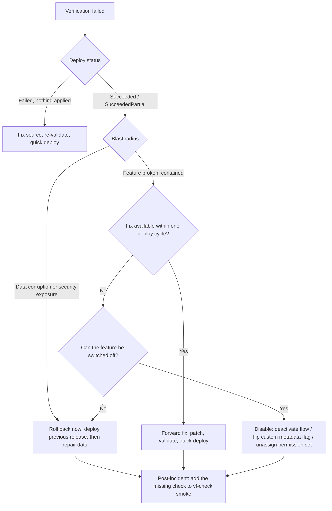

# Post-Deploy Verification

A deploy that says `Succeeded` proves that metadata compiled, not that the feature works. This skill
is the wave-4 gate: deploy result -> org Apex tests -> smoke probes -> data and configuration checks
-> org health -> report. Enforced by `vf-check smoke` and `vf-check verify`.

## When to use

| Trigger | Start at |
| --- | --- |
| `sf project deploy validate` / `quick` finished or timed out | Deployment result verification |
| Deploy status `Succeeded` but the story is unproven | Wave-4 sequence |
| Deploy status `Failed` / `SucceededPartial` | `references/failure-triage.md` |
| Apex tests failed in the org but pass locally | `references/failure-triage.md`, skill `sf-apex-testing` |
| Need a new smoke probe | `references/smoke-apex-scripts.md` |
| Need to confirm config landed (perm sets, flows, jobs, custom metadata) | `references/org-health-queries.md` |
| Asked "is this safe to leave in the org?" | Rollback vs forward-fix decision tree |

## Wave-4 sequence

Wave 3 (`sf-deploy-engineer`) runs serially: `deploy-validate` then `deploy-quick`. Wave 4 runs the
two branches in parallel; both must pass before the story is done.

| Step | Agent | Command | Pass criteria |
| --- | --- | --- | --- |
| 4.0 | `sf-deploy-engineer` | `sf project deploy report --job-id <id> --target-org <alias> --json` | `result.status = Succeeded`, `numberComponentErrors = 0` |
| 4.1a | `sf-test-engineer` | `vf-check apex --target-org <alias> --tests <list>` | All tests pass; class coverage >= `gates.apexClassCoverageMin`; org coverage >= `gates.apexOrgCoverageMin` |
| 4.1b | `sf-org-verifier` | `vf-check smoke --target-org <alias>` | Every probe exits 0; no new `AsyncApexJob` failures; limits within thresholds |
| 4.2 | `sf-org-verifier` | data + configuration queries (`references/org-health-queries.md`) | Row counts, active flow versions, perm-set assignments, scheduled jobs, custom metadata all as expected |
| 4.3 | `sf-org-verifier` | writes `.vibeforce/reports/smoke-<ISO>.json` | Report artefact present with `status: "pass"` |
| 4.4 | `sf-orchestrator` | reads both reports | Fails the story if either branch failed; applies the rollback/forward-fix tree |

```bash
node "${CLAUDE_PLUGIN_ROOT}/scripts/checks/vf-check.mjs" verify \
  --target-org vf-int --tests OrderServiceTest,BillingGatewayTest
```

`verify` = `apex` + `smoke`. Use `all` when the local gate has not run in this session.

## 1. Deployment result verification

```bash
# Status without polling (no --wait = single check)
sf project deploy report --job-id 0Afxx00000000AAA --target-org vf-int --json

# Poll until done, capture coverage and JUnit artefacts
sf project deploy report --use-most-recent --wait 30 \
  --coverage-formatters json-summary --junit --results-dir .vibeforce/reports/deploy \
  --target-org vf-int

# Resume watching a deploy that timed out or ran with --async (also updates source tracking)
sf project deploy resume --job-id 0Afxx00000000AAA --wait 30 --target-org vf-int
```

| Fact | Value |
| --- | --- |
| Job id lifetime | 10 days from the start of the deploy operation |
| `--use-most-recent` lookback | 3 days |
| `report` vs `resume` | `report` does not update source tracking; `resume` does |
| `--coverage-formatters` values | `clover, cobertura, html-spa, html, json, json-summary, lcovonly, none, teamcity, text, text-summary` |
| Commands that return a job id | `deploy start`, `deploy validate`, `deploy quick`, `deploy cancel` |

Deploy status JSON (field names from `@salesforce/source-deploy-retrieve`
`MetadataApiDeployStatus`):

```json
{
  "status": 0,
  "result": {
    "id": "0Afxx00000000AAA",
    "status": "Succeeded",
    "success": true,
    "done": true,
    "checkOnly": false,
    "numberComponentsTotal": 42,
    "numberComponentsDeployed": 42,
    "numberComponentErrors": 0,
    "numberTestsTotal": 118,
    "numberTestsCompleted": 118,
    "numberTestErrors": 0,
    "runTestsEnabled": true,
    "rollbackOnError": true,
    "details": {
      "componentFailures": [],
      "componentSuccesses": [],
      "runTestResult": {
        "numFailures": "0",
        "numTestsRun": "118",
        "totalTime": "92345.0",
        "failures": [],
        "codeCoverage": [],
        "codeCoverageWarnings": []
      }
    }
  }
}
```

`result.status` values: `Pending`, `InProgress`, `Succeeded`, `SucceededPartial`, `Failed`,
`Canceling`, `Canceled`, `Finalizing`, `FinalizingFailed`.

Component failure fields (`details.componentFailures[]`): `fullName`, `componentType`, `fileName`,
`problem`, `problemType` (`Error` | `Warning`), `lineNumber`, `columnNumber`, `success`, `created`,
`changed`, `deleted`. Test failure fields (`details.runTestResult.failures[]`): `name`,
`methodName`, `message`, `stackTrace`, `time`, `type`, `packageName`.

Failure triage table for common `problem` values: `references/failure-triage.md`.

## 2. Org Apex tests after deploy

Validation already ran tests, but a quick deploy skips them, and post-deploy runs catch
data-dependent failures that a validation on a different snapshot missed.

```bash
# Targeted, synchronous where possible (single class), JSON for the report
sf apex run test --tests OrderServiceTest.createsOrder --tests BillingGatewayTest \
  --code-coverage --result-format json --wait 20 --target-org vf-int

# Suite-based regression set
sf apex run test --suite-names Order_Regression --code-coverage --detailed-coverage \
  --result-format human --wait 30 --target-org vf-int

# Whole-org local tests (release gate)
sf apex run test --test-level RunLocalTests --code-coverage --result-format json \
  --wait 60 --output-dir .vibeforce/reports/apex --target-org vf-int

# Async run that timed out: fetch by test run id
sf apex get test --test-run-id 707xx0000000001 --code-coverage --result-format json --target-org vf-int
```

| Flag | Meaning |
| --- | --- |
| `--tests` | Class or `Class.method`; mutually exclusive with `--class-names` and `--suite-names` |
| `--class-names` / `--suite-names` | Whole classes / suites; also mutually exclusive with the others |
| `--test-level` | `RunSpecifiedTests`, `RunLocalTests` (default), `RunAllTestsInOrg` |
| `--synchronous` | Single class only; otherwise runs async and returns a test run id |
| `--wait` | Streaming client socket timeout in minutes |
| `--code-coverage` + `--result-format` | Required together to see coverage; `--detailed-coverage` needs human format |
| `--concise` | Failures only (human format) |
| Permission | Requires the `View All Data` system permission |

`testRunCoverage` in JSON/JUnit output is the percentage of covered lines across all Apex classes
exercised by that run - it is not the org-wide coverage figure. `RunSpecifiedTests` requires each
class and trigger in the deployment package to reach 75% individually. Gate values live in
`.vibeforce/config.json` (`apexOrgCoverageMin` 85, `apexClassCoverageMin` 75).

## 3. Anonymous-Apex smoke probes

```bash
sf apex run --file scripts/apex/smoke-core.apex --target-org vf-int --json
```

`sf apex run --json` returns `result.compiled`, `result.success`, `result.logs`, and
`result.diagnostic[]` (with `compileProblem`, `exceptionMessage`, `exceptionStackTrace`, `line`,
`column`). A probe signals failure by throwing, which flips `success` to false.

Non-negotiable probe rules:

| Rule | Why |
| --- | --- |
| Guard on `Organization.IsSandbox` before any DML | A smoke probe must never mutate production data |
| Prefer queries, `Schema` describes, and service instantiation over DML | Read-only probes are safe everywhere |
| When DML is unavoidable, wrap in `Database.setSavepoint()` + `Database.rollback()` | Nothing persists, even in a sandbox |
| Emit `VF_PROBE` marker lines with `LoggingLevel.ERROR` | Survives default log filters; the runner greps them |
| Throw on failure, never `System.debug` and continue | Non-zero exit code is the machine-readable signal |
| Callout probes point at sandbox endpoints only | See skill `sf-integration-patterns` |

Skeleton (full scripts in `references/smoke-apex-scripts.md`):

```apex
// scripts/apex/smoke-core.apex - read-only; safe in any org.
Organization org = [SELECT Id, Name, IsSandbox, OrganizationType, InstanceName FROM Organization LIMIT 1];
System.debug(LoggingLevel.ERROR, 'VF_PROBE org=' + org.Name + ' sandbox=' + org.IsSandbox);

List<String> failures = new List<String>();

// 1. Key objects and fields are visible and describable.
Map<String, Schema.SObjectType> globalDescribe = Schema.getGlobalDescribe();
for (String objectName : new List<String>{ 'Order__c', 'Order_Line__c' }) {
    if (!globalDescribe.containsKey(objectName.toLowerCase())) {
        failures.add('missing object: ' + objectName);
    }
}

// 2. Service classes instantiate and answer.
try {
    Integer open = OrderService.countOpenOrders();
    System.debug(LoggingLevel.ERROR, 'VF_PROBE openOrders=' + open);
} catch (Exception e) {
    failures.add('OrderService.countOpenOrders: ' + e.getMessage());
}

if (!failures.isEmpty()) {
    throw new IllegalArgumentException('VF_PROBE_FAIL ' + String.join(failures, ' | '));
}
System.debug(LoggingLevel.ERROR, 'VF_PROBE_OK smoke-core');
```

## 4. Data verification

```bash
# Row counts after a data-touching deploy
sf data query --target-org vf-int --result-format json \
  --query "SELECT COUNT(Id) total FROM Order__c WHERE Status__c = 'Open'"

# Referential integrity: orphans that a schema change may have created
sf data query --target-org vf-int \
  --query "SELECT COUNT(Id) FROM Order_Line__c WHERE Order__c = null"

# Picklist values and record types actually available
sf data query --target-org vf-int --use-tooling-api \
  --query "SELECT Id, DeveloperName, SobjectType, IsActive FROM RecordType WHERE SobjectType = 'Order__c'"
```

Full query catalogue (picklist values via `PicklistValueInfo`, custom metadata rows, duplicate
external ids, storage): `references/org-health-queries.md`. Data loading and export mechanics: skill
`sf-data-management`.

## 5. Configuration verification

```bash
# Permission set assignment landed on the integration user
sf data query --target-org vf-int --query \
  "SELECT PermissionSet.Name, Assignee.Username FROM PermissionSetAssignment WHERE PermissionSet.Name = 'Order_Management'"

# Flow active version
sf data query --target-org vf-int --query \
  "SELECT ApiName, Label, IsActive, ProcessType, TriggerType, ActiveVersionId FROM FlowDefinitionView WHERE ApiName = 'Order_Routing'"

# Scheduled jobs present and due to fire
sf data query --target-org vf-int --query \
  "SELECT CronJobDetail.Name, State, NextFireTime, PreviousFireTime, TimesTriggered FROM CronTrigger ORDER BY NextFireTime"

# Custom metadata rows deployed
sf data query --target-org vf-int --query \
  "SELECT DeveloperName, Label FROM Integration_Setting__mdt ORDER BY DeveloperName"

# Platform event channel / named credential presence
sf org list metadata --metadata-type PlatformEventChannel --target-org vf-int --json
sf org list metadata --metadata-type NamedCredential --target-org vf-int --json
```

Named Credential reachability is a callout, so it belongs in a smoke probe, not a query - see
`references/smoke-apex-scripts.md` and skill `sf-integration-patterns`.

## 6. Limits and org health

```bash
sf org list limits --target-org vf-int --json          # alias: sf limits api display
sf org display --target-org vf-int --json              # connection, instance URL, org id
sf org display --target-org vf-int --verbose           # includes the SFDX auth URL - never log it

# Async failures created by the deploy or the smoke run
sf data query --target-org vf-int --query \
  "SELECT ApexClass.Name, JobType, Status, ExtendedStatus, NumberOfErrors, CompletedDate \
   FROM AsyncApexJob WHERE Status IN ('Failed','Aborted') AND CreatedDate = TODAY ORDER BY CompletedDate DESC"

# Unexpected exceptions in logs produced during the probe window
sf apex list log --target-org vf-int --json
sf apex get log --log-id 07Lxx00000000AA --target-org vf-int
```

Limits worth gating on: `DailyApiRequests`, `DailyAsyncApexExecutions`, `DailyBulkApiBatches`,
`DataStorageMB`, `FileStorageMB`, `HourlyPublishedPlatformEvents`, `DailyDeliveredPlatformEvents`,
`HourlyODataCallout`, `ActiveScratchOrgs`. Label descriptions:
https://developer.salesforce.com/docs/platform/api-rest/guide/resources-limits.html

## 7. UI-level verification

| Option | Command / tool | Use |
| --- | --- | --- |
| Manual spot check | `sf org open --path lightning/o/Order__c/list --target-org vf-int` | Human confirmation of a page or layout |
| Generate a link without opening a browser | `sf org open --path lightning --url-only --target-org vf-int` | Paste into a ticket or report |
| Open the component in its builder | `sf org open --source-file force-app/main/default/flows/Order_Routing.flow-meta.xml --target-org vf-int` | Confirm a Flow/FlexiPage deployed as intended |
| Automated UI regression | Playwright, or UTAM page objects for Lightning | Out of scope for `vf-check`; run in a dedicated suite |
| Local component preview | `sf lightning dev app` / `sf lightning dev component` | Pre-deploy only; it does not verify the deployed org state (skill `sf-local-development`) |

LWC behaviour is proven by Jest locally (`vf-check jest`) plus one manual or Playwright pass; do not
pretend an org query verifies a rendered component.

## 8. Rollback vs forward fix



| Situation | Action | Command |
| --- | --- | --- |
| Deploy failed, nothing applied | Forward fix; the org is untouched | `vf-check deploy-validate` after the code change |
| Apex test failure caused by test data only | Forward fix the test | `sf apex run test --tests ...` |
| Feature broken but isolated | Forward fix | `sf project deploy validate` then `sf project deploy quick` |
| Flow misrouting records | Disable first | deactivate the flow version, then forward fix |
| Permission exposure | Roll back the permission set immediately | deploy the previous permission set version; revoke assignments |
| Data already corrupted | Roll back code, then repair data | previous release deploy + corrective data job |
| Destructive change deployed by mistake | Re-deploy the removed metadata from source control | `sf project deploy start --source-dir <path>` |

Salesforce has no transactional "undo" for a completed deploy: rollback means deploying the previous
known-good source. Detail and command sequences: `references/failure-triage.md`; deploy strategy and
release branching: skill `sf-deployment-strategies`.

## 9. Report artefact

`vf-check smoke` writes `<project>/.vibeforce/reports/smoke-<ISO>.json`:

```json
{
  "check": "smoke",
  "startedAt": "2026-09-12T09:14:22.104Z",
  "durationMs": 48210,
  "status": "fail",
  "targetOrg": "vf-int",
  "orgInfo": { "orgId": "00Dxx0000001gPFEAY", "instanceUrl": "https://example.my.salesforce.com", "isSandbox": true },
  "deploy": { "jobId": "0Afxx00000000AAA", "status": "Succeeded", "numberComponentErrors": 0 },
  "gates": { "asyncApexFailures": 0, "apiUsagePercentMax": 80 },
  "findings": [
    {
      "id": "smoke.apex.smoke-integration",
      "severity": "error",
      "probe": "scripts/apex/smoke-integration.apex",
      "message": "VF_PROBE_FAIL Billing_API health check returned 503",
      "evidence": { "compiled": true, "success": false, "line": 18 }
    }
  ],
  "raw": { "probes": [], "limits": {}, "queries": {} }
}
```

`status` is `pass` when `findings` has no `error` entries. Exit codes follow the runner contract:
0 pass, 1 gate failed, 2 misconfiguration, 3 org/network error.

## 10. Checklist by change type

| Change type | Required checks |
| --- | --- |
| Apex only | deploy report clean; `sf apex run test --tests <changed tests> --code-coverage`; `smoke-core.apex`; `AsyncApexJob` failures = 0 |
| LWC only | `vf-check jest` locally; deploy report clean; `sf org open --path` on the host page or a Playwright pass; browser console free of errors |
| Schema change (object, field, record type) | deploy report clean; `Schema` describe probe; `RecordType`/`PicklistValueInfo` queries; orphan-row query; `DataStorageMB` limit |
| Permission change | `PermissionSetAssignment` query; `smoke-permissions.apex` (describe-based CRUD/FLS assertions); negative check that a non-assigned user is still denied |
| Integration change | Named Credential/External Credential presence; `smoke-integration.apex` callout probe against a sandbox endpoint; dead-letter count = 0; `HourlyPublishedPlatformEvents` and `DailyDeliveredPlatformEvents` within limits |
| Flow change | `FlowDefinitionView` active version matches the deployed version; flow test run if flow tests exist; probe the records the flow should have produced |
| Scheduled job change | `CronTrigger` row exists with the expected `CronJobDetail.Name` and a future `NextFireTime`; `AsyncApexJob` for the previous run is `Completed` |
| Data load | row counts; duplicate external-id query; `DailyBulkApiBatches` usage; failed-record results from the bulk job |

Exact commands and pass criteria per row: `references/verification-catalogue.md`.

## References

- [references/verification-catalogue.md](references/verification-catalogue.md) - change type ->
  checks -> exact commands -> pass criteria.
- [references/smoke-apex-scripts.md](references/smoke-apex-scripts.md) - complete runnable
  anonymous-Apex probes and how to parse their output.
- [references/org-health-queries.md](references/org-health-queries.md) - SOQL and Tooling API
  queries for jobs, flows, permissions, limits, and errors.
- [references/failure-triage.md](references/failure-triage.md) - deploy/test/smoke failure ->
  diagnosis -> action, including rollback versus forward fix.

Official documentation used:

- `sf project deploy report` - https://developer.salesforce.com/docs/platform/salesforce-cli-reference/guide/cli_reference_project_deploy_report.html
- `sf project deploy resume` - https://developer.salesforce.com/docs/platform/salesforce-cli-reference/guide/cli_reference_project_deploy_resume.html
- `sf project deploy quick` - https://developer.salesforce.com/docs/platform/salesforce-cli-reference/guide/cli_reference_project_deploy_quick.html
- `sf apex run test` - https://developer.salesforce.com/docs/platform/salesforce-cli-reference/guide/cli_reference_apex_run_test.html
- `sf apex get test` - https://developer.salesforce.com/docs/platform/salesforce-cli-reference/guide/cli_reference_apex_get_test.html
- `sf apex run` - https://developer.salesforce.com/docs/platform/salesforce-cli-reference/guide/cli_reference_apex_run.html
- `sf data query` - https://developer.salesforce.com/docs/platform/salesforce-cli-reference/guide/cli_reference_data_query.html
- `sf org list limits` - https://developer.salesforce.com/docs/platform/salesforce-cli-reference/guide/cli_reference_org_list_limits.html
- `sf org open` - https://developer.salesforce.com/docs/platform/salesforce-cli-reference/guide/cli_reference_org_open.html
- Limits REST resource labels - https://developer.salesforce.com/docs/platform/api-rest/guide/resources-limits.html
