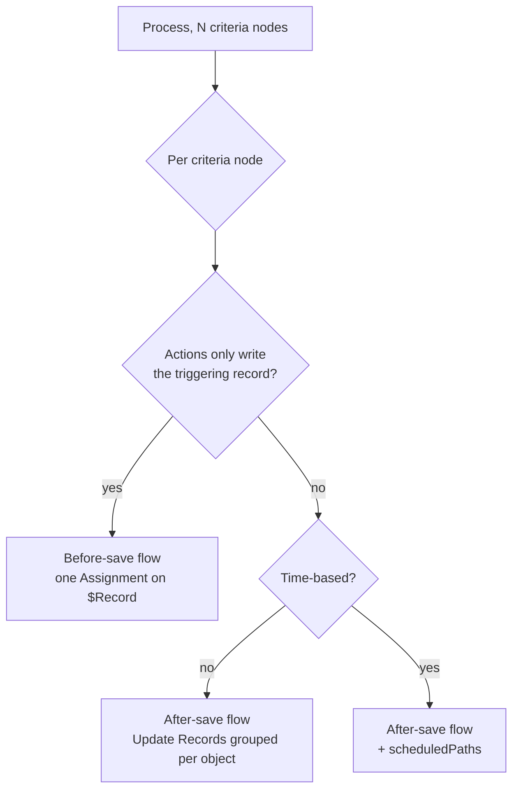

# Process Builder Migration

## When to use

- The org still has active processes. Salesforce blocked *creating* processes in Summer '23 and ended
  support for Process Builder and Workflow Rules on 31 December 2025. Existing processes still
  execute, unsupported.
- A field is written by both a process and a flow, or two processes write it in step 13 of the save
  order, where **no order is guaranteed**.
- A story touches an object that a process automates: migrate that concern first, then build.
- `/vf-check analyzer` or an audit (`sf-technical-debt-audit`) reports active processes.

A process is **not its own metadata type**. It is a `Flow` whose `processType` is `Workflow`, stored
in `flows/` with a `.flow-meta.xml` suffix like every other flow. So a repository with "no Process
Builder directory" can still be full of processes, and the retrieve command is `Flow`, not `Process`.

| `processType` | What it is | Migratable |
| --- | --- | --- |
| `Workflow` | Record change process - starts when a record is created or edited | Yes, this skill |
| `InvocableProcess` | Invoked by another process or the Invocable Actions REST resource | Not by the Setup tool; rebuild as a subflow or an autolaunched flow |
| `CustomEvent` | Event process, started by a platform event message | Not by the Setup tool; rebuild as a platform event-triggered flow |
| anything else | Already a flow | Nothing to migrate |

## Decision table: which route for which process

| Situation | Route | Why |
| --- | --- | --- |
| Whole process, mixed actions, you want it off Process Builder today | **Migrate to Flow** in Setup | It migrates the whole process as an after-save flow and reports what needs review |
| A criteria node whose actions only stamp fields on the triggering record | **`/vf-migrate-process convert`** | Emits a before-save flow: no extra DML, no second save |
| Process with scheduled actions | **Migrate to Flow**, one outcome at a time | Scheduled actions migrate only when you select the single criteria they belong to |
| Invocable or event process | **Rebuild by hand** | Out of scope for the Setup tool |
| Criteria with related-record fields, or a formula with a cross-object reference | **Rebuild by hand** | Field traversals are unsupported; a cross-object formula reference cannot migrate at all |
| Process plus an Apex trigger on the same object | **Decide one owner first** | Migrating an ordering bug produces a flow with the same ordering bug |
| Process nobody can explain | **Read the org, not the file** | `FlowDefinitionView`, debug logs, then this skill |

The Setup tool and this plugin's converter answer different questions. The Setup tool is the fastest
way to a *working* after-save flow. `/vf-migrate-process` is the way to a *cheap* before-save flow
for the nodes that qualify, and an explicit list of what does not.

## 1. Inventory before touching anything

```bash
# Every process and flow the org runs, with its type and status
sf data query --use-tooling-api --target-org <alias> \
  --query "SELECT ApiName, Label, ProcessType, TriggerType, Status, VersionNumber FROM FlowDefinitionView WHERE ProcessType IN ('Workflow','InvocableProcess','CustomEvent')"

# Pull them into source; the metadata type is Flow
sf project retrieve start --metadata Flow:Case_triage --target-org <alias>

# What else automates the same object
sf data query --use-tooling-api --target-org <alias> \
  --query "SELECT Name, TableEnumOrId, Status FROM ApexTrigger WHERE TableEnumOrId = 'Case'"
```

Record the answer in `.vibeforce/state/contract.md`: object, process name, who else writes those
fields. A migration that does not know the other writers is a rewrite with extra steps.

## 2. Read the process without reading the XML

A process file is large and almost entirely canvas coordinates and `processMetadataValues`. Reading
it whole costs tens of thousands of tokens and tells you nothing the plan does not.

```bash
node "$CLAUDE_PLUGIN_ROOT/scripts/vf-process-to-flow.js" plan \
  force-app/main/default/flows/Case_triage.flow-meta.xml
```

The plan prints, per criteria node: the conditions as flow entry conditions would express them, the
field writes that can become before-save assignments, the actions that must become after-save
elements, the scheduled actions, and every reason the node cannot be converted mechanically. It
quotes no XML. Exit `1` means the *file* does not convert - the wrong `processType`, an unreadable
trigger, no reachable criteria node.

The command wrapper is [`/vf-migrate-process`](../../commands/vf-migrate-process.md); the guard that
denies whole-file reads of big metadata is described in `sf-project-structure`.

## 3. Target architecture, decided before any conversion

One process usually becomes **more than one flow**, because a process mixes work that belongs on
different sides of the save.



Rules that decide the shape:

1. **Field writes on the triggering record go before save.** A before-save flow assigns to
   `$Record`. An Update Records element on the triggering record saves the record a second time,
   which is exactly the cost the migration is supposed to remove.
2. **One Update Records element per target object**, not per field. A process with four updates to
   the same Account is one element with four `inputAssignments`.
3. **One flow per object per timing**, not one flow per criteria node, once you are past the
   mechanical conversion. Entry conditions and a Decision inside the flow cost less than five flows
   racing in step 14.
4. **Never both.** The process is deactivated at the end of the migration, not kept "just in case".

## 4. Criteria nodes to entry conditions

| Process criteria | Flow | Notes |
| --- | --- | --- |
| Conditions are met, `AND` / `OR` | `start.filters` + `filterLogic` `and` / `or` | Straight mapping |
| Conditions are met, custom logic (`1 AND (2 OR 3)`) | `filterLogic` with the same string | Flow accepts the logic string |
| No criteria - just execute the actions | No `filters` at all | The flow runs on every save that matches the trigger |
| Formula evaluates to true | Entry formula, or a Decision | References must be rewritten from `[Object].Field` / `myVariable_current.Field` to `{!$Record.Field}` |
| Advanced: only when the record is created or edited to meet criteria | `doesRequireRecordChangedToMeetCriteria` `true` | Same intent, same wording in the metadata |
| `myVariable_old.Field` | `{!$Record__Prior.Field}` in a **Decision** or an entry formula | Entry conditions cannot read prior values |
| Related-record field (`myVariable_current.Account.Industry`) | Get Records + Decision | Entry conditions filter the triggering record only |

Operators are where a conversion quietly breaks. `FlowRecordFilter` (entry conditions) accepts only
`EqualTo`, `NotEqualTo`, `GreaterThan`, `LessThan`, `GreaterThanOrEqualTo`, `LessThanOrEqualTo`,
`StartsWith`, `EndsWith`, `Contains`, `IsNull`. A process condition may use any `FlowComparisonOperator`,
including `IsChanged`, `WasSet` and `In`, which have **no entry-condition form**: rebuild them as a
Decision, or as an entry formula comparing `{!$Record.F}` with `{!$Record__Prior.F}`.

## 5. Action groups to flow elements

| Process action | Flow element | Migrate to Flow tool |
| --- | --- | --- |
| Update Records, triggering record, literal or same-record reference | Assignment on `$Record`, before save | Migrates as after-save; optimise by hand |
| Update Records, related records | Update Records, after save, grouped per object | Supported |
| Create a Record | Create Records, after save | Supported |
| Email Alerts | Action element, after save | Supported |
| Apex | Action element (`@InvocableMethod`) | Supported |
| Flows | **Subflow**, same transaction | Supported, but redesign anything with a callout or a pause as an asynchronous path |
| Post to Chatter, Quick Actions, Submit for Approval, Send Custom Notification, Send Surveys, Quip, Live Message | Same element, **needs configuration after migration** | Partial |
| Processes (invocable) | Subflow or autolaunched flow | Unsupported |
| Scheduled actions | `scheduledPaths` on an after-save flow | Only when you migrate the single criteria that owns them |

`sf-flow-automation` owns the element-level detail of the flow you are building;
`sf-apex-development` owns the invocable class behind an Apex action.

## 6. Scheduled actions to scheduled paths

| Process | Flow |
| --- | --- |
| Scheduled action, *N* days/hours after the record date field | `scheduledPaths` entry with `timeSource` `RecordField`, `recordField`, `offsetNumber`, `offsetUnit` |
| Scheduled action *N* hours after the triggering event | `timeSource` `RecordTriggerEvent` with the offset |
| Pending actions already queued in the org | The migrated flow deletes the process's pending actions at run time and re-queues them on the right path, or cancels them when the record no longer qualifies |

A time-based process migrates **one outcome per flow**. Select several criteria in the Setup tool and
no scheduled action is migrated at all. Monitor the queue in Setup before and after: pending items
that silently disappear are the failure mode.

## 7. The two semantics a mechanical conversion gets wrong

**Start-of-process values.** When a process continues to the next criteria node - the
`EVALUATE THE NEXT CRITERIA` option - the next node evaluates the values the record had **at the
beginning of the process**. A flow does the opposite: a Decision after an Assignment sees the value
the Assignment just wrote. Chained criteria therefore cannot be split into independent flows, or
turned into a straight Decision chain, without deciding which value each branch should see. The
converter blocks these nodes instead of emitting them.

**Reevaluation.** A process may be configured to evaluate the same record up to five additional
times in a single save. Flows have no equivalent, and Salesforce documents that a migrated process
with recursion is evaluated only once. If the process relied on reevaluating - `ISNEW`, `PRIORVALUE`
or a field the process itself changes - the migrated flow is a different automation and needs a
deliberate test, not a diff.

## 8. Cutover, in two deploys

```bash
# 1. plan, then convert what converts
node "$CLAUDE_PLUGIN_ROOT/scripts/vf-process-to-flow.js" plan <process file>
node "$CLAUDE_PLUGIN_ROOT/scripts/vf-process-to-flow.js" convert <process file> --criteria 'myRule_1'

# 2. build the after-save half by hand from the plan's after-save lines

# 3. shape and validate before an org sees it
node "$CLAUDE_PLUGIN_ROOT/scripts/checks/vf-check.mjs" local --files <flow file>
sf project deploy validate --source-dir <flow file> --target-org <alias>

# 4. deploy the flows, activate them, verify behaviour against real records
# 5. only then, in a second deploy, deactivate the process
```

The order is not negotiable. Deactivating first leaves a window with no automation. Doing both in one
deploy leaves no way to roll back one half. Keeping both active writes the same field twice in one
save, in an order the platform does not define.

## Anti-patterns

### One flow per criteria node, all after-save, Update Records on the triggering record

```xml
<!-- WRONG: the record is saved a second time on every trigger -->
<recordUpdates>
    <name>Stamp_the_case</name>
    <inputReference>$Record</inputReference>
    <inputAssignments>
        <field>Priority</field>
        <value><stringValue>High</stringValue></value>
    </inputAssignments>
</recordUpdates>
```

```xml
<!-- RIGHT: before save, one Assignment, no DML -->
<assignments>
    <name>Set_Fields</name>
    <assignmentItems>
        <assignToReference>$Record.Priority</assignToReference>
        <operator>Assign</operator>
        <value><stringValue>High</stringValue></value>
    </assignmentItems>
</assignments>
```

### Deploying the generated flow under the process's own API name

A `Flow` deployed with the process's `fullName` becomes a **new version of the process**, not a new
flow. The converter refuses the name collision; do not work around it with `--flow-name` set to the
same value.

### Turning a criteria chain into a Decision chain and calling it equivalent

The second outcome now sees fields the first outcome wrote. See section 7. Either keep the chain in
one flow and decide each branch's inputs deliberately, or split it and re-derive each entry
condition.

### Copying a process formula into a flow formula

Process formulas reference `[Object].Field` or `myVariable_current.Field`; flow formulas need
`{!$Record.Field}`. A cross-object reference in a process formula cannot be migrated at all - it
needs a Get Records element and a new formula.

### Migrating with the process left active "until we are sure"

Two automations writing one field in one save, ordered by nothing. If confidence is the problem, the
answer is a sandbox and a scratch org, not a double write.

### Reading the process file into the session to plan the migration

Tens of thousands of tokens for information `plan` prints in twenty lines.

## Verification

```bash
# The process file is a process, and this is what it does
node "$CLAUDE_PLUGIN_ROOT/scripts/vf-process-to-flow.js" plan <process file>

# The generated flow: XML shape, api version, formatting, static analysis
node "$CLAUDE_PLUGIN_ROOT/scripts/checks/vf-check.mjs" local --files <flow file>
node "$CLAUDE_PLUGIN_ROOT/scripts/checks/vf-check.mjs" analyzer --files <flow file>

# The org accepts it, without deploying it
sf project deploy validate --source-dir <flow file> --target-org <alias>

# After deploy: the flow is the active version and the process is not
sf data query --use-tooling-api --target-org <alias> \
  --query "SELECT ApiName, ProcessType, Status, VersionNumber FROM FlowDefinitionView WHERE ApiName IN ('Case_triage','Case_New_and_mine_Before')"

# The behaviour, on a real record
sf data create record --sobject Case --values "Status=New Origin=Web" --target-org <alias>
sf data query --query "SELECT Id, Priority, Subject FROM Case ORDER BY CreatedDate DESC LIMIT 1" --target-org <alias>

# Which automation actually ran
sf apex get log --number 1 --target-org <alias> | grep -E "FLOW_|CODE_UNIT_STARTED"
```

`sf-post-deploy-verification` owns the probe-and-rollback decision; `sf-debugging-logs` owns the
`FLOW_*` markers and the `Workflow` log category that records processes and flows.

## References

- [references/process-metadata-anatomy.md](references/process-metadata-anatomy.md) - a process file element by element, the reference and operator mapping tables, the converter's contract and exit codes
- [references/migrate-to-flow-tool.md](references/migrate-to-flow-tool.md) - the Setup tool's supported and unsupported lists, partial migration, scheduled actions, the manual conversion methods

Sibling skills: `sf-flow-automation` (the flow you are building, plus
[workflow rule migration](../sf-flow-automation/references/workflow-to-flow-migration.md)),
`sf-apex-development` (order of execution, invocable Apex), `sf-technical-debt-audit` (finding the
processes still running), `sf-minimal-change` (how small the change should be),
`sf-project-structure` (`flows/` and the metadata token bill), `sf-deployment-strategies` (flow
activation on deploy), `sf-post-deploy-verification` (proving the cutover worked).

Sources: Metadata API Developer Guide, `Flow` (`FlowProcessType`, `FlowStart`, `FlowRecordFilter`,
`FlowRecordFilterOperator`, `FlowScheduledPath`); "Automate Your Business Processes" - Process
Builder, Execute Actions for Multiple Criteria, Reevaluate Records in the Process Builder, Migrate to
Flow Tool Considerations, Move Processes and Workflows to Flow Builder with the Migrate to Flow Tool;
Salesforce Help, end of support for Workflow Rules and Process Builder. API version 67.0.
